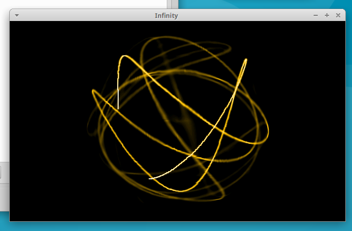

Infinity
========

A lightweight audio visualizer for Linux.
Reacts to whatever's playing on your desktop and renders it as fluid, generative light patterns.


Requirements
------------

Runtime: PipeWire 0.3, GTK+ 3.x, GLib 2.28

Build tools: Meson, Ninja, pkg-config

**Install Deps**

Tested in Ubuntu 22 & 24.

`sudo apt-get -y install meson ninja-build pkgconf libglib2.0-dev libgtk-3-dev libpipewire-0.3-dev wireplumber pipewire-pulse libpulse-dev`

Build & Install
---------------

```
git clone https://github.com/dprotti/infinity-plugin
cd infinity-plugin
meson setup build -Db_lto=true
meson compile -C build
sudo meson install -C build
```

Then just run:
```
infinity
```

A window titled "Infinity" should appear and start reacting to audio playing on your desktop.



Enter / leave full-screen by pressing `F11`.

Troubleshooting
---------------

### Visualization is not reacting to audio

Infinity captures audio from your default output device (speakers/headphones)
via PipeWire. If the visualization runs but ignores desktop audio, work through
these steps.

**1. Confirm PipeWire is the active audio server**

```
pactl info | grep "Server Name"
```

Expected output contains `PulseAudio (on PipeWire ...)`. If it says only
`pulseaudio`, PipeWire is not running. Enable it:

```
sudo apt-get install pipewire-pulse wireplumber
systemctl --user disable pulseaudio.service pulseaudio.socket
systemctl --user mask pulseaudio
systemctl --user enable pipewire pipewire-pulse wireplumber
systemctl --user start pipewire pipewire-pulse wireplumber
```

Log out and back in, then re-run the `pactl info` check.

**2. Confirm a monitor source exists**

```
pactl list sources short | grep monitor
```

You should see at least one line with `monitor` in the name and status
`RUNNING` or `IDLE`. If the list is empty, your ALSA driver may not be
exposing a loopback — check `dmesg | grep snd` for ALSA errors.

**3. Confirm WirePlumber is running**

WirePlumber is the session manager that links Infinity to the monitor source.
Without it the stream stays in `paused` state indefinitely.

```
systemctl --user status wireplumber
```

If it is not active, start it:

```
systemctl --user enable --now wireplumber
```

Then restart Infinity.

Authors
-------
- Duilio Protti - maintainer, 2004-2026
- James Carthew - audacious 4.x support, Qt UI, Meson build, bug fixes, 2026
- CBke - patches, 2016
- John Lightsey - portability fixes and GPL License compliance, 2004
- Jean Delvare - patches, 2004
- Will Tatam - RPM packaging, 2004
- Haavard Kvaalen - autotools build, 2000
- Chris Lea (C) - RPM packaging, 2000
- Mitja Horvat - optimisations, 2000
- Julien Carme - original author, 2000

Contributions
-------------

Contributions and bug reports are welcome!
If something's broken or you have an idea, open an issue at https://github.com/dprotti/infinity-plugin/issues

Old Versions
------------

Can be found at Sourceforge: <https://sourceforge.net/projects/infinity-plugin/>
